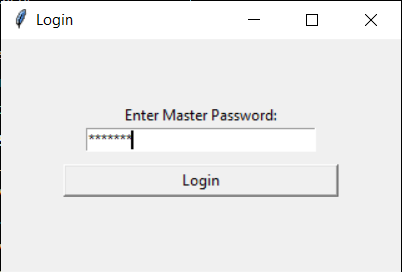
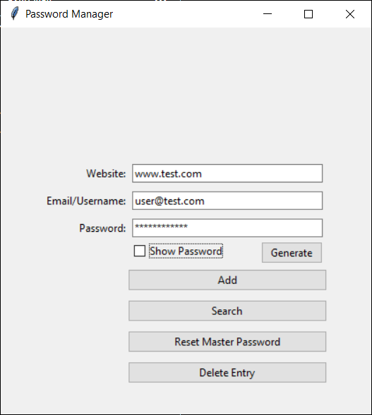
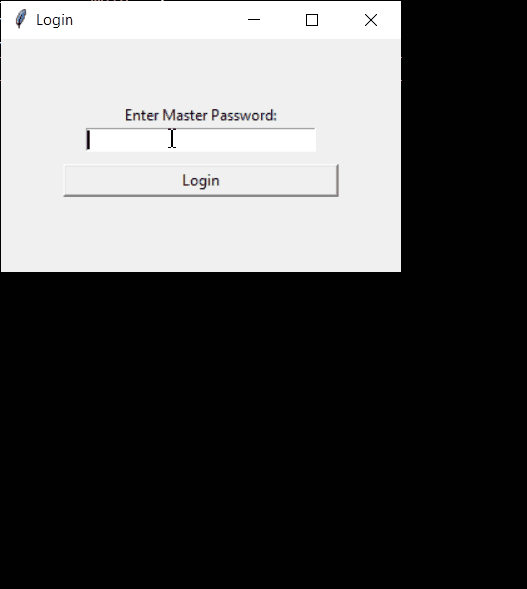

# 🔐 Password Manager GUI

A fully polished, secure password manager built with Python and Tkinter — featuring master password login, encryption, password generation, credential storage, and more.

> 🛠️ **Note:** This is the desktop GUI version of my Password Manager project.  
> ✅ A more advanced, full-stack **[Web Version](https://github.com/Cyber-Security-Tech/password-manager-web)** with added features and live deployment is also available.

---

## 📸 Screenshots

### 🔑 Master Password Login


### 🧩 Main App Interface


---

## 🎥 Demo



---

## ✨ Features

- **Master Password Login**
  - Secure entry gate using a hashed password stored in `config.json`
  - Prevents unauthorized access to saved credentials

- **Encrypted Credential Storage**
  - Uses `cryptography.fernet` to encrypt all emails and passwords
  - Data is saved in a JSON file in the `data/` folder

- **Password Generator**
  - Creates strong, random passwords with one click
  - Automatically copied to clipboard

- **CRUD Functionality**
  - Add, search, and delete credentials
  - Handles multiple accounts for the same website
  - Optional dropdown selection for duplicate entries

- **Master Password Reset**
  - Secure flow to update the stored master password with re-authentication

- **Modern UI**
  - Clean, organized interface using `ttk` styling
  - Show/hide password toggle
  - Dialogs for errors, confirmations, and success states

---

## 💾 Technologies Used

- Python 3
- Tkinter / ttk
- `cryptography` (Fernet encryption)
- `werkzeug.security` (password hashing)
- `json` (data handling)
- `os` (safe file creation and paths)

---

## 📂 Folder Structure

```
password-manager-gui/
├── app.py                  # Clean launcher for the app
├── ui.py                   # Main GUI logic
├── login.py                # Master password entry window
├── data_manager.py         # Handles file I/O
├── password_logic.py       # Business logic and validation
├── password_generator.py   # Random password generation
├── encryption.py           # AES-style encryption with Fernet
├── config.json             # Stores hashed master password (ignored in Git)
├── data/
│   └── passwords.json      # Encrypted credential store (optional in Git)
├── screenshot_login.png    # Screenshot of login screen
├── screenshot_main.png     # Screenshot of main app
├── demo.gif                # Demo showing full feature flow
├── requirements.txt         # Dependency list for pip install
├── .gitignore
└── README.md
```

---

## 🧠 What I Learned

- Built secure desktop apps using **Tkinter** and modular code design
- Applied **AES-level encryption** via `cryptography.fernet`
- Implemented **secure password hashing** with `werkzeug`
- Designed user flows with validation, confirmation, and error handling
- **Translated this architecture** into a full-stack Flask web app for deployment

---

## 🚀 How to Run Locally

1. Clone the repo:
```bash
git clone https://github.com/Cyber-Security-Tech/password-manager-gui.git
cd password-manager-gui
```

2. Install requirements:
```bash
pip install -r requirements.txt
```

3. Run the app:
```bash
python app.py
```

---

## 🛑 Git Notes

- `config.json` (master password hash) is **not tracked** for security
- `data/passwords.json` is ignored to prevent sensitive data exposure

---

## 🔮 Future Improvements

- Add categories or tags for saved credentials
- Add export/import functionality for encrypted vaults
- Add password update support for existing entries
- Add usage analytics (offline-safe)
- Build mobile version in Kivy or web version (✅ already done)

---

## 🌐 See the Web Version

The full-stack, deployed **web version** is here:  
👉 [**Password Manager Web App**](https://github.com/Cyber-Security-Tech/password-manager-web)

It includes:
- User registration & login
- Vault encryption
- Responsive web UI
- Deployed on Render

